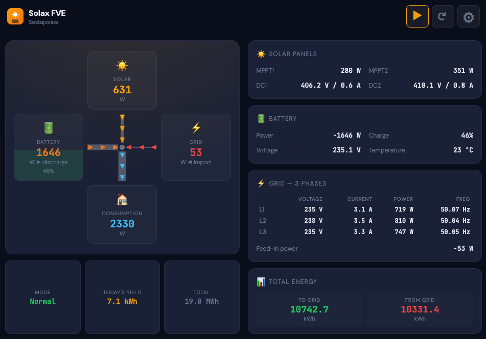
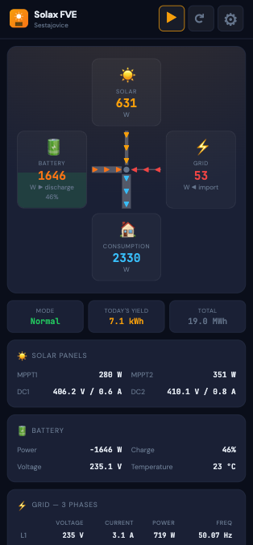

# Solax FVE Live Monitor

Live monitoring app for Solax X3 Hybrid G4 inverters. Android Phone or TV connects directly to the inverter on your home network. A web application is provided for all other devices and to allow remote access to your inverter from the internet over HTTPS, also for the Android application.

<a href="docs/tablet-screenshot.png"></a> <a href="docs/phone-screenshot.png"></a>

- Tested with **Solax X3 Hybrid G4**, **Pocket WiFi 3.0 dongle**
- Live power flow visualization (Solar, Battery, Grid, Home consumption)
- 3-phase grid details (voltage, current, power, frequency)
- Battery status (SoC, voltage, temperature, charge/discharge)
- EPS (backup power) monitoring
- Energy totals (daily solar, battery, grid in/out; totals)
- Multiple inverter support with quick switching
- Works as a standalone Android app (phone and also TV) or a web app in the browser
- Dark and Light mode (dark by default)
- Double tap to zoom, then zoom out on double tap or automatically after 8 seconds
- Full screen support, show/hide top menu on app icon tap
- Use TCP modbus from within the home network, HTTP for WiFi 3.0 dongle HTTP API, or HTTPS when connecting from outside to a proxy.
- Instructions provided on how to install and host the web application and a proxy server as a [service on Raspberry Pi](./docs/remote-hosting-through-raspberry-pi.md)

### Install on Android phone / TV

The easiest way to install the APK package on your phone without a USB cable is via [LocalSend](https://localsend.org/):

1. Install LocalSend on both your computer and phone
2. Make sure both devices are on the same WiFi network
3. Open LocalSend on both devices
4. [Download the latest APK](https://github.com/sranka/solax-fve-live-app/releases)
5. From your computer, send the APK file
6. Accept the file on your phone/TV and open it to install
7. You may need to allow installation from unknown sources in your phone's settings
8. Open the application and connect to your Solax inverter. You need to know the IP address of your Solax dongle.

## Web Application

Web application is run with [Node.js 18+](https://nodejs.org/en/download), no other dependencies are required.

```bash
MODBUS=1 PROXY_TARGET=http://192.168.199.192 node scripts/server.js
```

An HTTP server is started at [http://localhost:8080](http://localhost:8080). It serves the web app and proxies HTTP POST requests to the inverter specified by `PROXY_TARGET`. This avoids CORS/mixed-content issues without any special browser flags.

The server also acts as an HTTP proxy to Solax Modbus TCP. Set `MODBUS=1` to make Modbus the default for POST requests (the Modbus host is derived from `PROXY_TARGET`). Both `/http` and `/modbus` endpoints are also available for side-by-side comparison.

When using the web app at http://localhost:8080, set the inverter hostname in the app's connection settings to:

- `localhost:8080/http` — Solax HTTP API
- `localhost:8080/modbus` — Solax Modbus TCP
- `localhost:8080` — server default (depends on the `MODBUS=1` environment variable)

```bash
# HTTP proxy by default:
PROXY_TARGET=http://192.168.199.192 pnpm start

# Modbus TCP as default:
MODBUS=1 PROXY_TARGET=http://192.168.199.192 pnpm start
```

## Development
### Android App

The project uses [Capacitor](https://capacitorjs.com/) to wrap the web app into a native Android application. This removes the HTTPS/mixed-content restriction — the app can freely connect to inverters over Solax Modbus TCP or to Solax local HTTP API on the local network.

#### Prerequisites

- Node.js 18+
- JDK 21 (the project includes `.sdkmanrc` for [SDKMAN!](https://sdkman.io/) users)
- Android Studio (optional — you can build from the command line)

#### Build APK

```bash
pnpm install
pnpm run build
```

The APK will be at `android/app/build/outputs/apk/debug/app-debug.apk`.

Alternatively, open the project in Android Studio and build from there:

```bash
npx cap open android
```

Then **Build > Build Bundle(s) / APK(s) > Build APK(s)**.

## License

MIT
